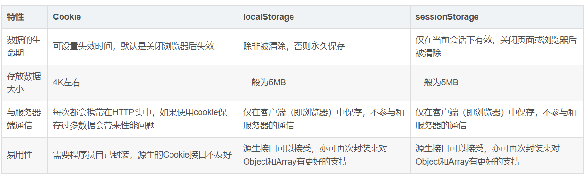

1.说说你知道的http协议
+ http全名叫做超文本传输协议
+ http协议定义了web客户端怎么从web服务端请求获取数据，以及服务器如何把web界面传给客户端，采用了请求/响应两种模型
```
在浏览器地址栏键入URL，按下回车之后会经历以下流程：

浏览器向 DNS 服务器请求解析该 URL 中的域名所对应的 IP 地址;
解析出 IP 地址后，根据该 IP 地址和默认端口 80，和服务器建立TCP连接;
浏览器发出读取文件(URL 中域名后面部分对应的文件)的HTTP 请求，该请求报文作为 TCP 三次握手的第三个报文的数据发送给服务器;
服务器对浏览器请求作出响应，并把对应的 html 文本发送给浏览器;
释放 TCP连接;
浏览器将该 html 文本并显示内容; 
```

2.说说tcp协议

```
```
 + 为什么是三次握手，2次不行吗
 + tcp与udp的区别 

3.说说常见的http请求状态码

4.说说常见的http请求头

5.get/post的区别
+ 请求方式上：get请求数据会附加在url上，post会放在http请求体中
+ 传输数据大小上：get受限于url长度的限制，post理论上不会受到限制
+ 安全性上：post的安全性比GET高，比如，在进行登录操作，通过GET请求，用户名和密码都会暴露再URL上
+ 缓存上：get请求会被缓存和收藏为书签，post不会被缓存和收藏成书签
+ 编码上：get只能进行url编码，post支持多种编码方式
+ get通常通过地址栏输出，post通常通过form发送数据

6.除了get/post还有什么请求头，以及用法

7.nginx反向代理流程

8.git的常用指令

9.promise的原理以及用法

10.跨域设置
- CORS
  + CORS允许浏览器向跨源服务器，发出XMLHttpRequest请求，从而克服了AJAX只能同源使用的限制
  ```
  1.新建一个XMLHttpRequest的实例
  var xhr = new XMLHttpRequest();

  2.向远程主机发出一个HTTP请求
  　xhr.open('GET', 'example.php');
　　xhr.send();

  3.等待远程主机做出回应。这时需要监控XMLHttpRequest对象的状态变化，指定回调函数。
  xhr.onreadystatechange = function(){

　　　　if ( xhr.readyState == 4 && xhr.status == 200 ) {

　　　　　　alert( xhr.responseText );

　　　　} else {

　　　　　　alert( xhr.statusText );

　　　　}

　　};

    readyState 0表示未初始化 还没调用send()方法
               1已经调用send()方法，正在发送请求
               2载入完成send()方法已经执行，已经接收到全部响应内容
               3交互，正在解析响应内容
               4完成，响应解析内容完成
  ```
  + 设置Access-Control-Allow-Origin '*'表示可以接收任意域名的访问 也可以设置指定域名访问
- jsonp
  + jsonp的实现原理就是在script标签里面加载了一个链接，去访问服务器的某个请求，返回内容

```
在ajax中解决跨域

前端
设置 dataType : "jsonp",//数据类型为jsonp  
设置 jsonp : "jsonpCallback",//服务端用于接收callback调用的function名的参数

后端
执行这个回调
```

11.localStorage的作用
+ 1.localstorage为标准的键值对（Key-Value,简称KV）数据类型，简单但也易扩展
+ 2.localstorage原生是不支持设置过期时间的
+ 3.目前上统一为5M，已经比cookies的4K要大很多了
+ 4.localstorage是无法跨域的
+ 5.localStorage不能被爬虫抓取到

12.cookie和session
（1）数据存储：
cookie以明文的方式存储在浏览器端，session存储在服务器端；
（2）安全性：
由于存储位置的原因，也就出现了浏览器端是不够安全的（但是，我们可以通过加密技术解决这个问题），服务器端更为安全；
（3）生命周期：
cookie的生命周期是累计的，从创建时，就开始计时，20分钟后，cookie生命周期结束，
session的生命周期是间隔的，从创建时，开始计时如在20分钟，没有访问session，那么session生命周期被销但是，如果在20分钟内（如在第19分钟时）访问过session，那么，将重新计算session的生命周期， 
Session的默认失效时间是30分钟
Cookie只在当前会话内有效,关闭浏览器后即被丢弃
（4）使用原则：
cookie的缺陷，每个站点只能保存20个cookie，每个cookie大小4k以内；session是存放服务器端，会占用服务器内存，因此我们建议不要往session中存放过多过大的对象

localStorage生命周期是永久，这意味着除非用户显示在浏览器提供的UI上清除localStorage信息，否则这些信息将永远存在。
sessionStorage生命周期为当前窗口或标签页，一旦窗口或标签页被永久关闭了，那么所有通过sessionStorage存储的数据也就被清空了。




13.TCP/IP四层结构
+ 应用层
  - 向用户提供了应用服务时的通信活动
  - FTP DNS HTTP
+ 传输层
  - 提供处于网络连接中的两台计算机之间的数据传输
  - TCP UDP
+ 网络层
  - 用于处理在网络上流动的数据包
+ 数据链路层
  - 用来处理连接网络的硬件部分

15.react中hooks的钩子函数
+ useState 通过在函数组件里调用它来给组件添加修改一些内部 state
+ useEffect 它跟 class 组件中的 componentDidMount、componentDidUpdate 和 componentWillUnmount 具有相同的用途，只不过被合并成了一个 API
+ useRef React 都会将 ref 对象的 .current 属性设置为相应的 DOM 节点
+ useMemo 我们想在组件挂载之前就做一些事情可以使用 useMemo

17.设计模式-发布订阅者模式

18.设计模式-观察者者模式

